# Securing Applications with Docker EE Advanced

In this lab you will integrate Docker EE Advanced in to your development pipeline. You will build your application from a Dockerfile and push your image to the Docker Trusted Registry (DTR). DTR will scan your image for vulnerabilities so they can be fixed before your application is deployed. This helps you build more secure apps!


> **Difficulty**: Beginner

> **Time**: Approximately 30 minutes

> **Tasks**:
>
> * [Prerequisites](#prerequisites)
> * [Introduction](#introduction)
> * [Task 1: Accessing PWD](#task1)
> * [Task 2: Create Secrets](#task2)
> * [Task 3: Deploy Docker Stack](#task3)
> * [Task 4: Create DTR Repository](#task4)
>   * [Task 4.1: Enable Docker Image Scanning](#task4.1)
>   * [Task 4.2: Create Repositories](#task4.2)
>   * [Task 4.3: Create Promotion Policy](#task4.3)
> * [Task 5: Pull / Push Docker Image ](#task5)
>   * [Task 5.1: Pull Image](#task5.1)
>   * [Task 5.2: Tag Image](#task5.2)
>   * [Task 5.3: Push Image](#task5.2)
> * [Task 6: Docker Content Trust ](#task6)
>   * [Task 6.1: Enable Content Trust](#task6.1)
>   * [Task 6.2: Push Image](#task6.2)


## Document conventions
When you encounter a phrase in between `<` and `>`  you are meant to substitute in a different value.
We are going to leverage the power of [Play With Docker](http://play-with-docker.com).

###<a name="abbreviations"></a>Abbreviations
The following abbreviations are used in this document:

* UCP = Universal Control Plane
* DTR = Docker Trusted Registry
* DCT = Docker Content Trust
* EE = Docker Enterprise Edition
* BOM = Bill of Materials
* CVE = Common Vulnerabilities and Exposures
* PWD = Play With Docker

## <a name="prerequisites"></a>Prerequisites
This lab requires an instance of Docker Enterprise Edition (EE). Docker Enterprise Edition includes Docker Universal Control Plane and Docker Trusted Registry. This lab provides Docker EE. 

## Understanding the Play With Docker Interface

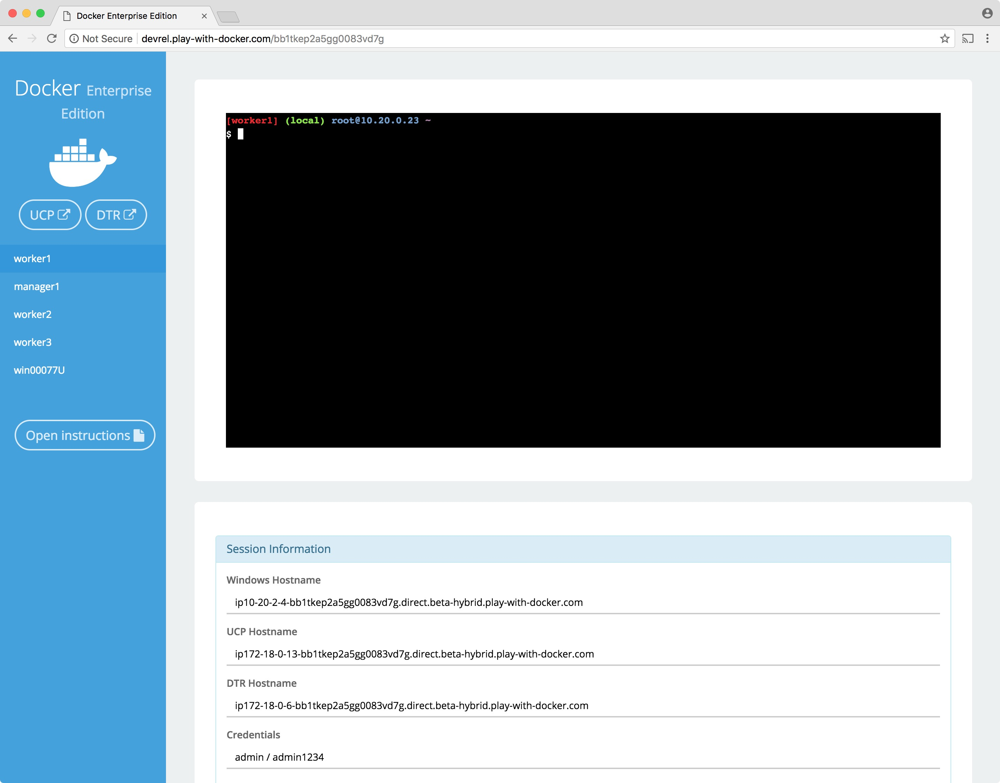

This workshop is only available to people in a pre-arranged workshop. That may happen through a [Docker Meetup](https://events.docker.com/chapters/), a conference workshop that is being led by someone who has made these arrangements, or special arrangements between Docker and your company. The workshop leader will provide you with the URL to a workshop environment that includes [Docker Enterprise Edition](https://www.docker.com/enterprise-edition). The environment will be based on [Play with Docker](https://labs.play-with-docker.com/).

If none of these apply to you, contact your local [Docker Meetup Chapter](https://events.docker.com/chapters/) and ask if there are any scheduled workshops. In the meantime, you may be interested in the labs available through the [Play with Docker Classroom](training.play-with-docker.com).

There are three main components to the Play With Docker (PWD) interface. 

### 1. Console Access
Play with Docker provides access to the 3 Docker EE hosts in your Cluster. These machines are:

* A Linux-based Docker EE 18.01 Manager node
* Three Linux-based Docker EE 18.01 Worker nodes
* A Windows Server 2016-based Docker EE 17.06 Worker Node

> **Important Note: beta** Please note, as of now this is a beta Docker EE 2.0 environment. Docker EE 2.0 shows off the new Kubernetes functionality which is described below.

By clicking a name on the left, the console window will be connected to that node.

### 2. Access to your Universal Control Plane (UCP) and Docker Trusted Registry (DTR) servers
Additionally, the PWD screen provides you with a one-click access to the Universal Control Plane (UCP)
web-based management interface as well as the Docker Trusted Registry (DTR) web-based management interface. Clicking on either the `UCP` or `DTR` button will bring up the respective server web interface in a new tab.

### 3. Session Information
Throughout the lab you will be asked to provide either hostnames or login credentials that are unique to your environment. These are displayed for you at the bottom of the screen. 

## <a name="introduction"></a> Introduction
This workshop is designed to demonstrate the power of Docker Secrets, Image Promotion, Scanning Engine, and Content Trust. We will walk through creating a few secrets. Deploying a stack that uses the secret. Then we will create a Docker Trusted Registry repository where we can create a promotion policy. The promotion policy leverages the output from Image Scanning result. This is the foundation of creating a Secure Supply Chain. You can read more about  secure supply chains for our [Secure Supply Chain reference architecture](https://success.docker.com/article/secure-supply-chain).

## <a name="task 1"></a>Task 1: Accessing PWD
1. Navigate in your web browser to the URL the workshop organizer provided to you.

2. Fill out the form, and click `submit`. You will then be redirected to the PWD environment.

	It may take a few minutes to provision out your PWD environment. After this step completes, you'll be ready to move on to task 1.2: Install a Windows worker node

## <a name="task2"></a>Task 2: Create Secrets 
Background: Secrets are...

* Up to 500kb each.
* Encrypted at rest.
* Encrypted in transit.
* Store on an in-memory filesystem on the worker node. 

1. From the main PWD screen click the `UCP` button on the left side of the screen

	> **Note**: Because this is a lab-based install of Docker EE we are using the default self-signed certs. Because of this your browser may display a security warning. It is safe to click through this warning.
	>
	> In a production environment you would use certs from a trusted certificate authority and would not see this screen.
	>
	> 

2. When prompted enter your username and password (these can be found below the console window in the main PWD screen). The UCP web interface should load up in your web browser.

	> **Note**: Once the main UCP screen loads you'll notice there is a red warning bar displayed at the top of the UCP screen, this is an artifact of running in a lab environment. A UCP server configured for a production environment would not display this warning
	>
	> 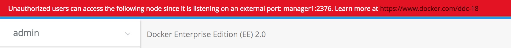

3. Navigate to `Swarm` --> `Secrets` on the left hand menu. And then click `Create Secret`.
    > 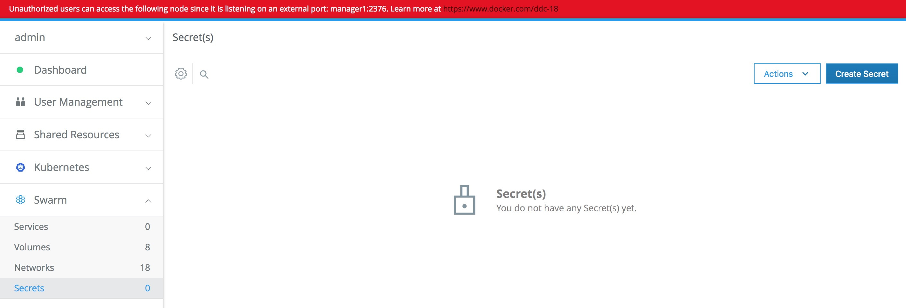
    
4. We are going to create a secret titled `title_v1`. The Content of the secret doesn't matter. Here is an idea `2018 Fed Summit is fun and secure.` We do not need to add it to a collection at this point. It will default to our private collection. 
    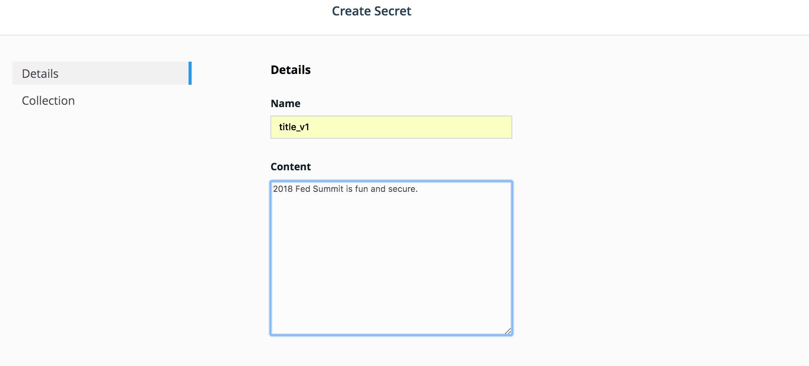

5. Now lets create a second secret called `title_v2` with the content `2018 Dockercon might be funner.`. 
  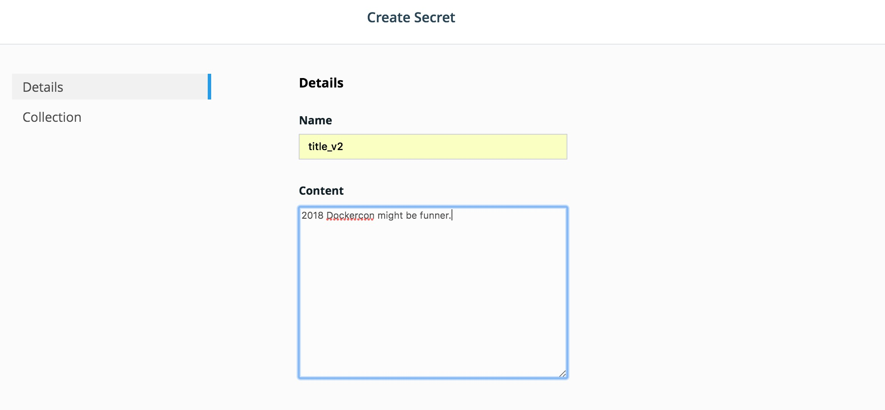

6. You should now have two secrets named `title_v1` and `title_v2`.
  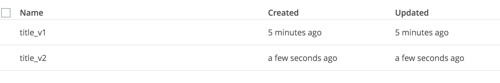

Perfect. Now we can deploy a services that will use the first secret. 


## <a name="task3"></a>Task 3: Deploy Docker Stack
Background: A Stack is a collection of services described in a single yaml. And deployed as a single unit. This can be very helpful when deploying large sets of services. 

We are going to use a `Stack` to deploy a `Service` that will use the newly created secrets. 

1. Navigate to `Shared Resources` --> `Stacks` on the left hand menu. And then click `Create Stack`.
2. Name can be anything unique. Lets use `summit`. The Mode should be `Swarm Services`. And paste in the following:

  ```yaml
  version: "3.3"
  services:
    app:
      image: clemenko/fedsummit_2018
      deploy:
        replicas: 2
        mode: replicated
        placement:
          constraints:
            - 'node.role == worker'
      ports:
        - 5000:5000
      secrets:
        - source: title_v1
          target: secret

  secrets:
    title_v1:
      external: true
  ```
   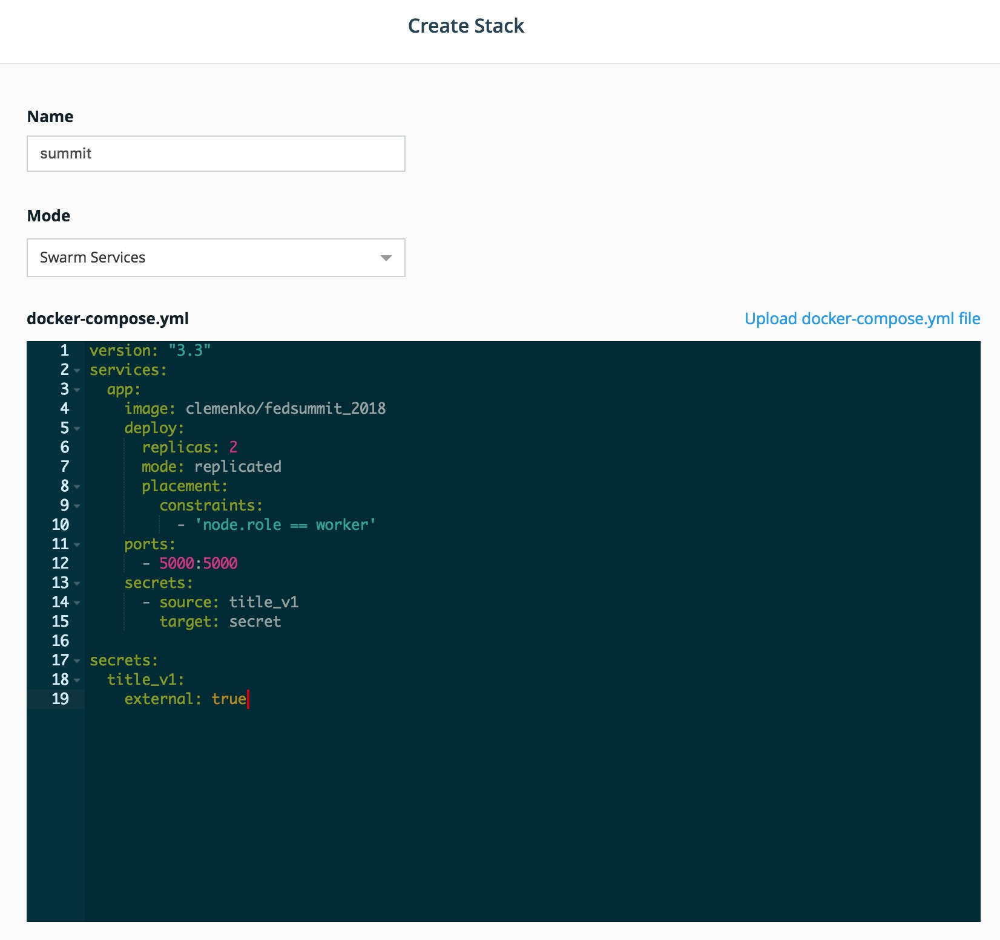

3. Once the deploy is complete click `Done`. No we can verify it is deployed by navigating to `Shared Resources` --> `Services` and look for the `summit_app` service. 

  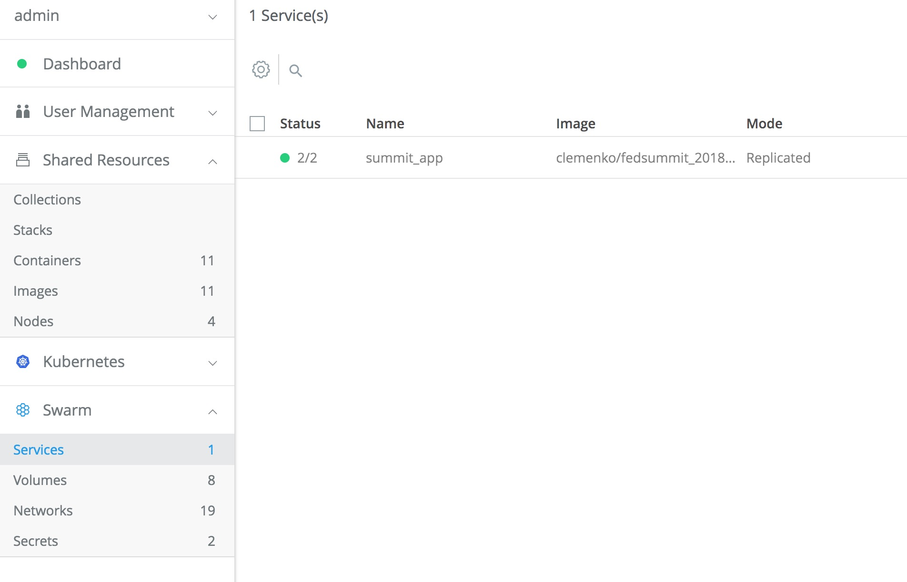
  
4. Lets check the resulting webpage. Click on the service itself --> `summit_app`. You will notice a Right hand menu appear. Here you will find a `Published Endpoints` section. Click on the endpoint. 
  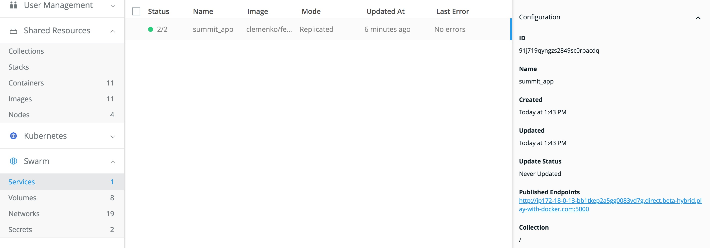
  
5. Once the page has loaded. Hit `Refresh` in the browser. Notice the `server` field change? There are actually two containers that are using the same secret. 
  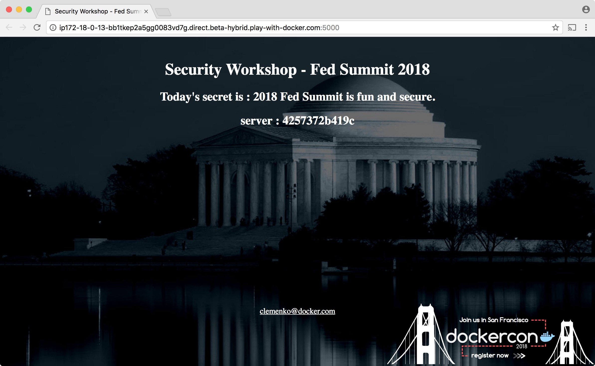

## <a name="task4"></a>Task 4: Create DTR Repository
We now need to access Docker Trusted Registry to setup two repositories. 

### <a name="task4.1"></a>Task 4.1: Enable Docker Image Scanning
Before we create the repositories, let's start with enabling the Docker Image Scanning engine. 

1. From the main PWD screen click the `DTR` button on the left side of the screen

	> **Note**: Because this is a lab-based install of Docker EE we are using the default self-signed certs. Because of this your browser may display a security warning. It is safe to click through this warning.
	>
	> In a production environment you would use certs from a trusted certificate authority and would not see this screen.
	>
	> 

2.  Navigate to `System` --> `Security`. 
3.  Select `Enable Scanning`. In the popup leave it in `Online` mode and select `Enable`. The CVE database will start downloading. 
    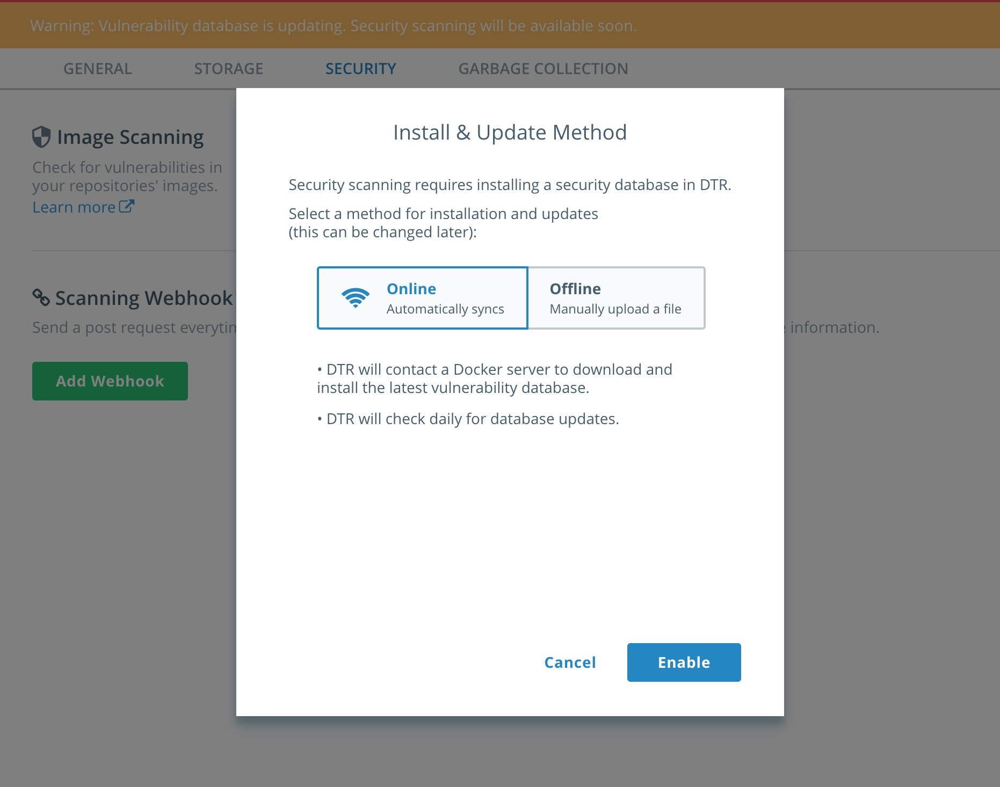	

### <a name="task4.2"></a>Task 4.2: Create Repositories
We can now create the two repositories. 

1. Navigate to `Repositories` on the left menu and click `New repository`.
2. Create that looks like `admin`/`alpine_build`. Make sure you click `Private`. Do not click `Create` yet!
3. Click `Show advanced settings` and then click `On Push` under `SCAN ON PUSH`.  This will ensure that the CVE scan will start right after every push to this repository.  Click `Create`.
  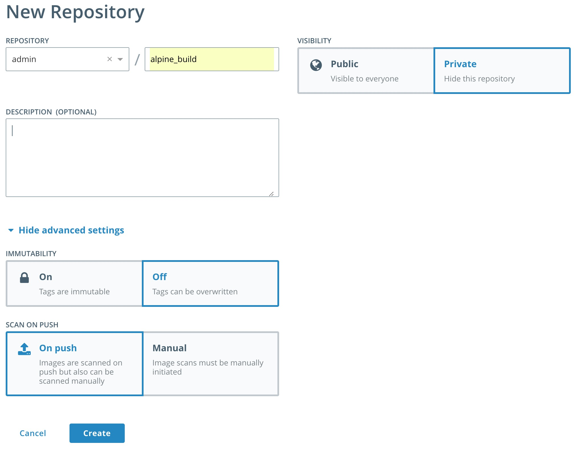
  
 4. Now let's create the second repository in a similar fashion. Create a `Public` repository as `admin`/`alpine` with `SCAN ON PUSH` set to `On Push`.
 
 5. We should have two repositories now. 
    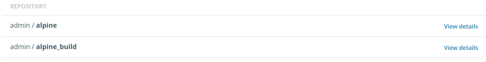

### <a name="task4.3"></a>Task 4.3: Create Promotion Policy
With the two repositories setup we can now define the promotion policy. We need to create a target policy that has a `CRITERIA` of `Critical Vulnerabilities` equal to zero. The policy will target the `admin`/`alpine` repository. 

1. Navigate to the `admin`/`alpine_build` repository. Click `Promotions` and click `New promotion policy`. 
2. In the `PROMOTE TO TARGET IF...` box select `Critical Vulnerabilities` and then check `equals`. In the box below `equals` enter the number zero (0) and click `Add`. 
3. Set the `TARGET REPOSITORY` to `admin`/`alpine` and click `Save & Apply`.
  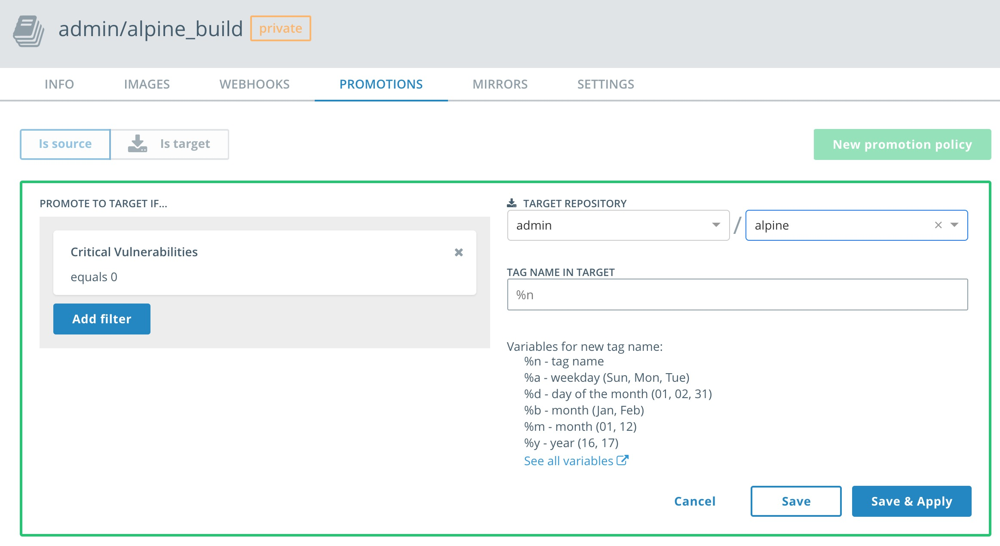
  
 Perfect. Now let's push am image that will be scanned and promoted. 

## <a name="task5"></a>Task 5: Pull / Push Docker Image 
In order to push and pull images to DTR we will need to take advantage of PWD's Console Access. 

1. Navigate back to the PWD tab in your browser. 
2. Click on `worker1`. Honestly, it doesn't matter which worker we use. We just need a docker daemon. 
3. In the console `docker pull alpine`. This command is pulling the `alpine` image from [hub.docker.com](https://hub.docker.com).

  ```
  [worker1] (local) root@10.20.0.23 ~
  $ docker pull alpine
  Using default tag: latest
  latest: Pulling from library/alpine
  Digest: sha256:7df6db5aa61ae9480f52f0b3a06a140ab98d427f86d8d5de0bedab9b8df6b1c0
  Status: Image is up to date for alpine:latest
 ```
 
4. Now let's tag the image for our DTR instance. The URL for the DTR instance can be found on the same page in the `Session Information` box. It is best to copy and paste the url into the next command. 
>**Note:** Copy the DTR Hostname! We need it for the next few commands. 

   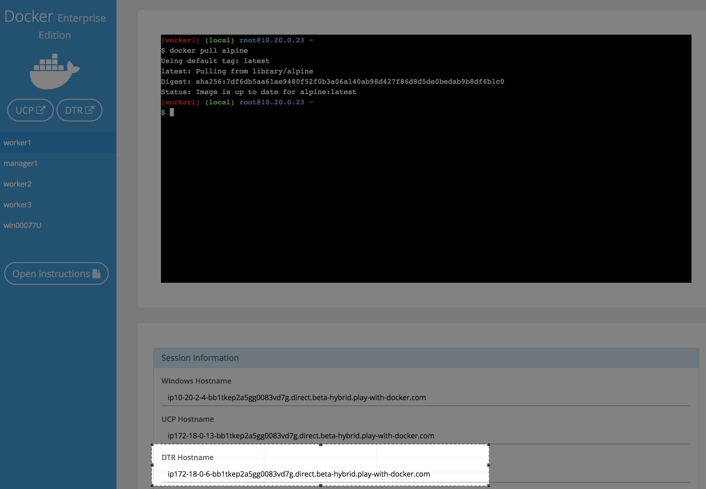 
   
   The tag command looks like `docker image tag <FROM> <TO>`. The section will start with the DTR Hostname and end with the repository name. In this example it will be `ip172-18-0-6-bb1tkep2a5gg0083vd7g.direct.beta-hybrid.play-with-docker.com/admin/alpine_build`. Notice the `admin/alpine_build` at the end?
   
   ```
   [worker1] (local) root@10.20.0.23 ~
   $ docker image tag alpine ip172-18-0-6-bb1tkep2a5gg0083vd7g.direct.beta-hybrid.play-with-docker.com/admin/alpine_build
   ```
 Please make sure that you are using the url from your PWD `Session Information`.

5. Now let's `docker login` into our DTR instance with the `admin` credentials. 
>**Note:** This is the same DTR Hostname as in the tag command. 

  ```
  [worker1] (local) root@10.20.0.23 ~
  $ docker login ip172-18-0-6-bb1tkep2a5gg0083vd7g.direct.beta-hybrid.play-with-docker.com
  Username (admin): admin
  Password:
  Login Succeeded
  ```
6. Now we can `docker push` the image to DTR.
 >**Note:** This is the same DTR Hostname as in the tag command.
  
  ```
  [worker1] (local) root@10.20.0.23 ~
  $ docker push ip172-18-0-6-bb1tkep2a5gg0083vd7g.direct.beta-hybrid.play-with-docker.com/admin/alpine_build
  The push refers to a repository [ip172-18-0-6-bb1tkep2a5gg0083vd7g.direct.beta-hybrid.play-with-docker.com/admin/alpine_build]
  cd7100a72410: Layer already exists
  latest: digest: sha256:8c03bb07a531c53ad7d0f6e7041b64d81f99c6e493cb39abba56d956b40eacbc size: 528
  ```

7. With the completed `docker push` we can now navigate back to the DTR's gui. From the gui we can check on the image scan. Navigate to `Repositories` --> `admin/alpine_build`--> `IMAGES`. You should see a similar image tagged `latest`.
 >**Note:** Did your image scan clean?
 
  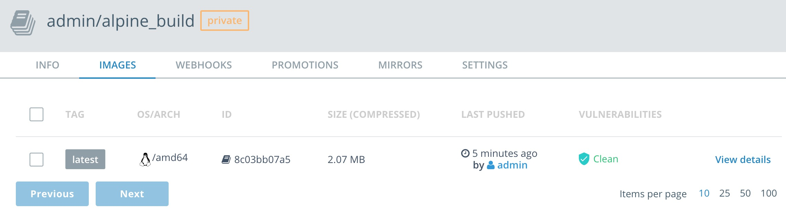
  
8. Now let's check the `admin/alpine` images. Navigate to `Repositories` --> `admin/alpine`--> `IMAGES`.
 >**Note:** Do you see the `PROMOTED` badge?

  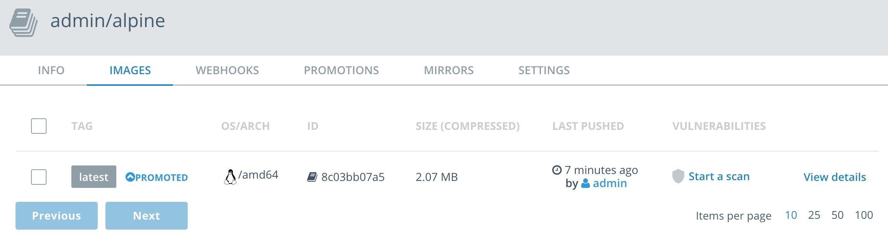

## <a name="task6"></a>Task 6: Docker Content Trust

